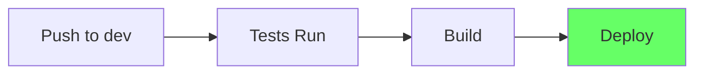
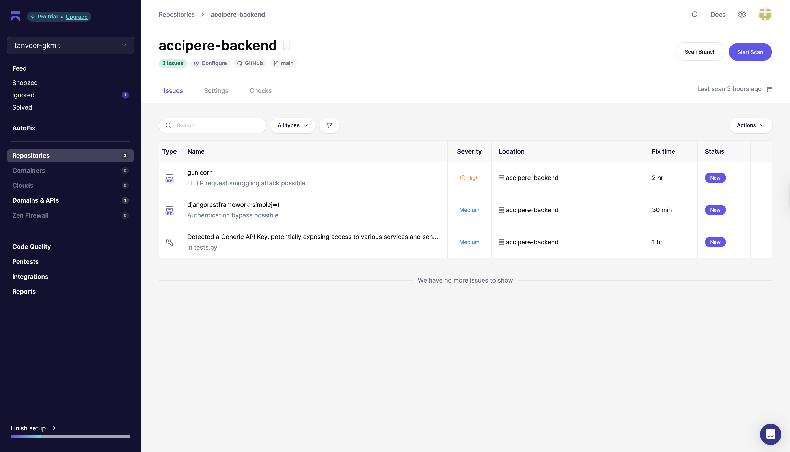

# CI/CD Pipeline

## How It Works

Push code to `dev` branch → GitHub Actions runs automatically → Deploys to production




---

## Backend (Django)

**File:** `.github/workflows/deploy.yml`

### Steps
1. Run tests with PostgreSQL
2. Build Docker image
3. Push to Docker Hub
4. SSH to EC2 and deploy

### Commands
```bash
# Test
python manage.py test

# Deploy (automatic on push)
docker run -d --name accipere-backend -p 8000:8000 username/image:tag
```

---

## Frontend (React)

**File:** `.github/workflows/deploy-s3.yml`

### Steps
1. Build React app
2. Upload to S3
3. Clear CloudFront cache

### Commands
```bash
# Build
npm run build

# Deploy (automatic on push)
aws s3 sync build/ s3://bucket-name --delete
```

---

## Security Scan

**File:** `.github/workflows/trivy-scan.yml`

Scans for vulnerabilities on `main` branch. Results in GitHub Security tab.

### Akido Scan Results



### False Positives / Known Findings
- **Issue 1 (Leaked Password):** The password detected in test cases is a sample password used for testing purposes and is not a security risk.


## Resolved Issues

- **Issue 1 & 2:** Fixed in the latest version.
    - **Issue 2 (CloudFront Headers):** Added all security headers in CloudFront to resolve the issue. There are no issues in the frontend.


---

## GitHub Secrets

**Backend:**
- `DJANGO_SECRET_KEY`
- `DOCKER_USERNAME`, `DOCKER_PASSWORD`
- `DEPLOY_HOST`, `DEPLOY_USER`, `DEPLOY_SSH_KEY`

**Frontend:**
- `VITE_API_BASE_URL`
- `AWS_ACCESS_KEY_ID`, `AWS_SECRET_ACCESS_KEY`
- `S3_BUCKET`, `CLOUDFRONT_DISTRIBUTION_ID`

Add in: Settings → Secrets → Actions

---

## Common Issues

| Problem | Fix |
|---------|-----|
| Tests fail | Check logs in Actions tab |
| Docker build fails | Check Code |
| Docker Build Fails | Remove the image from the ec2 instance storage may be full |
| EC2 deploy fails | Verify SSH key |
| S3 upload fails | Check AWS credentials |

---

## Rollback

```bash
# Backend - SSH to EC2
docker stop accipere-backend
docker run -d --name accipere-backend -p 8000:8000 username/image:old-tag

# Frontend - Revert commit
git revert HEAD
git push origin dev
```

---

## Logs

```bash
# GitHub Actions
Go to Actions tab → Click workflow

# Backend logs
docker logs -f accipere-backend

# Security scans
Go to Security tab
```

---

## Summary

- Push to `dev` = auto deploy
- Tests must pass first
- Takes 5-10 minutes
- Check Actions tab for status
- Rollback = revert commit or redeploy old image

That's it! 🚀