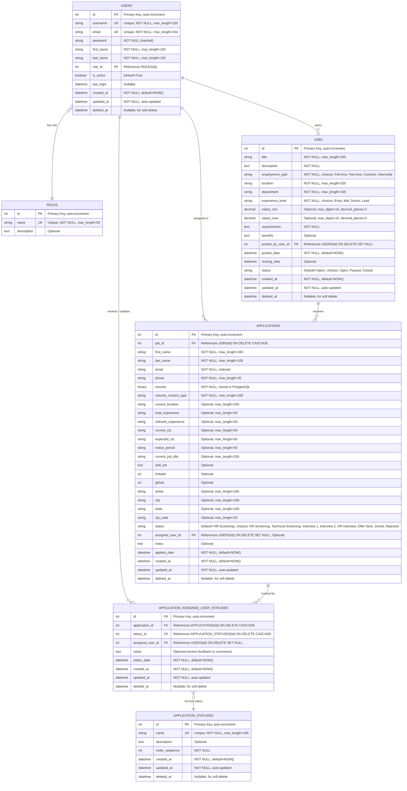

# Recruitment Management System (RMS)

## Executive Summary

Recruitment Management System (RMS): a cloud-hosted web app to streamline job posting, applicant tracking, status updates, and role-based access. Built with React, Django REST Framework, and PostgreSQL (RDS), deployed via CI/CD on AWS, with secure JWT authentication and a scalable backend—foundation for a future AI ATS.

## Purpose and Scope

### Purpose

The purpose of this project is to design and implement a centralized recruitment management system that digitizes and automates essential HR functions like job management, application tracking, and department-wise reviews.

### Scope

The system currently supports:

- Secure login and registration for Administrator ,Recruiter and Technical Evaluator
- Job posting and management
- application submission
- Recruitment status updates and interview sheduling
- Role-based permissions for data access and actions
- CI/CD deployment through GitHub Actions with AWS hosting

## System Architecture Overview

The system follows a modular, layered architecture deployed on AWS Cloud Infrastructure.

### 1. CI/CD Pipeline

- GitHub Actions handle automated build and deployment
- The frontend (React) and backend (Django REST Framework) are hosted separately, ensuring independent scalability
- Backend is deployed to AWS EC2, and frontend assets are served from AWS S3 via CloudFront for global availability

### 2. Backend Layer (Django REST Framework on EC2)

- Handles all business logic and RESTful API endpoints
- Uses JWT-based middleware for authentication and authorization
- Implements modular structure with Views, Serializers, and Models
- Interacts with PostgreSQL RDS for secure data storage and querying

### 3. Frontend Layer (React + Axios)

- Developed using React.js for a responsive, interactive UI
- Axios middleware manages API communication
- State management ensures smooth user experience across modules

### 4. Database Layer (PostgreSQL RDS)

- Stores structured data for users, roles, jobs, applicants, and applications
- Simple role-based access control with a dedicated ROLES table

## Architecture Diagram

## Database Architecture (ERD Overview)

The ER diagram defines clear relationships between the system's entities:

- **USERS** – System users (Administrator, Recruiter, Technical Evaluator)
- **ROLES** – Simple role definitions (Administrator, Recruiter, Technical Evaluator)
- **JOBS** – Job listings with complete details including salary range, requirements, and benefits
- **APPLICATIONS** – Contains all applicant information and application data
  - Stores resume as binary data in PostgreSQL
  - Includes professional details, contact info, and address
  - Tracks application status and assignment
- **APPLICATION_STATUSES** – Defines recruitment stages (HR Screening, Technical Screening, Interviews, etc.)
- **APPLICATION_ASSIGNED_USER_STATUSES** – Tracks status changes and user assignments 

> **Note:** For complete technical specifications, API endpoints, and implementation details, see the [Technical Documentation](technical-documentation.md) page.

### Database Entity Relationship Diagram

### Database Indexing Strategy

Essential indexes for better performance (Django creates most of these automatically):

#### USERS Table
- `email` - For login and user search
- `username` - For login
- `role_id` - Foreign key (auto-indexed by Django)

#### JOBS Table
- `status` - For filtering open/closed jobs
- `department` - For department filtering
- `posted_by_user_id` - Foreign key (auto-indexed by Django)

#### APPLICATIONS Table
- `email` - For searching applicants and preventing duplicates
- `status` - For filtering by application status
- `job_id` - Foreign key (auto-indexed by Django)
- `assigned_user_id` - Foreign key (auto-indexed by Django)

> **Note:** Django automatically creates indexes for Primary Keys, Foreign Keys, and fields with `unique=True`. You only need to manually add indexes for frequently filtered fields like `status`, `department`, and `email`.

## Goals

Build a working MVP for recruitment management. Future plan: add AI agents for ranking candidates, analyzing GitHub/LinkedIn profiles, automated phone calls for repetitive tasks like sheduling interview ,getting notice period other stuff , and smart filtering beyond just resumes.

## Functional Modules

### 1. Authentication and Authorization

- JWT-based login and sign-up system using Django REST Framework SimpleJWT
- Simple role-based access control with three roles: Administrator, Recruiter, and Technical Evaluator

### 2. Job Management

- Create, edit, and delete job postings
- Assign jobs to departments and specify employment details

### 3. Applicant Management

- Candidate registration and resume upload
- Apply for specific job openings

### 4. Application Tracking

- Department-wise review and comments on applications
- Track status transitions such as Applied, Under Review, Shortlisted, Rejected, or Hired

## Technical Requirements

| Component | Technology Stack |
|-----------|-----------------|
| Frontend | React.js, Axios, Tailwind CSS |
| Backend | Django REST Framework (Python), SimpleJWT Auth |
| Database | PostgreSQL (AWS RDS) |
| Hosting | AWS EC2 (Backend), AWS S3 + CloudFront (Frontend) |
| CI/CD | GitHub Actions |
| Authentication | JSON Web Token (JWT) via djangorestframework-simplejwt |
| Version Control | GitHub |

## Constraints

- Developed and maintained by a single developer; not much can be done
- Focused on building a solid foundation for data management and workflows
- AI-based candidate filtering and predictive analytics are deferred for later integration

## Use Cases

### Use Case 1: Applicant Applies for Job

**Actor:** Job Applicant

**Steps:**

1. Visit website and browse jobs
2. Click on a job to see details
3. Upload resume (PDF or DOC)
4. Fill out application form
5. Submit application
6. Get confirmation email

**Notes:**

- No login needed to browse jobs
- No login required 

---

### Use Case 2: Admin Adds New User

**Actor:** Admin

**Steps:**

1. Login to admin panel
2. Go to user management
3. Enter new user's email
4. Select their department
5. Assign group (Administrator, Recruiter and Technical Evaluator)
6. System sends invite email

**What happens next:**

- New user gets email with setup link
- Link expires in 48 hours
- User clicks link and creates password
- User can now login

---

### Use Case 3: HR Reviews Applications

**Actor:** HR Team Member

**Steps:**

1. Login to dashboard
2. See list of applications
3. Filter by status or job position
4. Click on an application to open it
5. Review resume and application form
6. Add notes for team
7. Update status (shortlist, reject, or interview)
8. System emails applicant about status change

**Notes:**

- Multiple HR members can review same application
- All changes are logged with timestamps

---

## Evaluation Plan and Metrics

| Metric | Description |
|--------|-------------|
| Data Accuracy | Ensured by foreign key constraints in PostgreSQL |
| Response Time | Measured for API endpoints |
| Deployment Stability | Tested through automated GitHub Actions runs |

## Future Enhancements

### Phase 1 - Core Features
- Email automation for status updates
- Job portal integration (LinkedIn, Indeed, Naukri)
- Analytics dashboard

### Phase 2 - Advanced Permission System
- Migrate to Django's built-in Groups and Permissions system
- Fine-grained permissions (AUTH_GROUPS, AUTH_PERMISSIONS, AUTH_USER_GROUPS, etc.)
- Custom permission assignments per user
- Content type framework for generic relations (DJANGO_CONTENT_TYPES)
- Group-level permission management (AUTH_GROUP_PERMISSIONS)
- User-specific permission overrides (AUTH_USER_USER_PERMISSIONS)

### Phase 3 - AI Features
- AI resume parsing and ranking
- AI agents to analyze GitHub, LinkedIn, portfolios
- Automated phone calls for repetitive info (joining date, salary)
- Smart candidate matching beyond keywords

## Conclusion

The Recruitment Management System (RMS) provides a reliable foundation for automating company internal hiring process. By combining Django REST Framework, React, and AWS, it establishes a scalable and secure system architecture.

This base version focuses on streamlining recruitment workflows and cloud-ready infrastructure—serving as a strong platform for future expansion into a full-featured AI-driven Applicant Tracking System (ATS).
