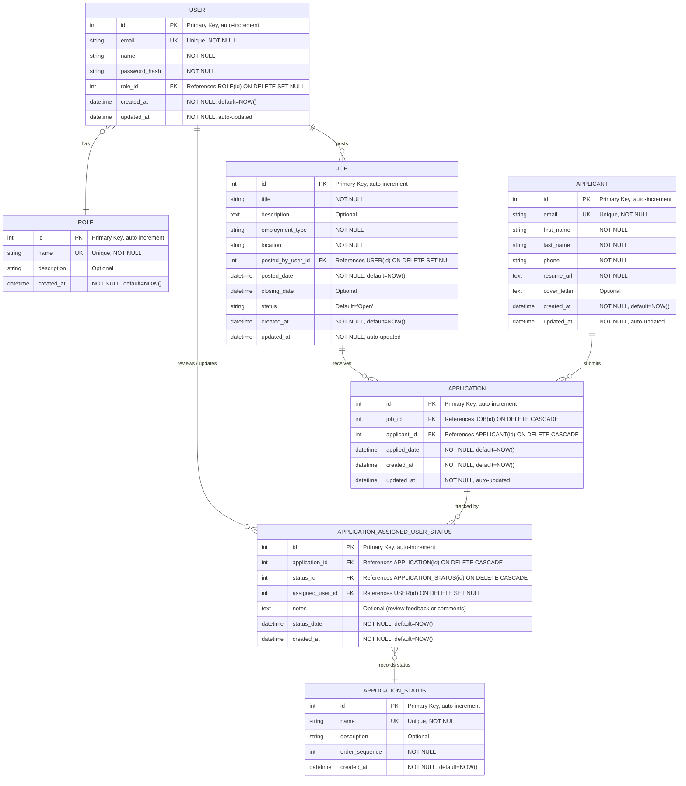

# Recruitment Management System (RMS)

## Executive Summary

Recruitment Management System (RMS): a cloud-hosted web app to streamline job posting, applicant tracking, status updates, and role-based access. Built with React, FastAPI, and PostgreSQL (RDS), deployed via CI/CD on AWS, with secure JWT authentication and a scalable backend—foundation for a future AI ATS.

## Purpose and Scope

### Purpose

The purpose of this project is to design and implement a centralized recruitment management system that digitizes and automates essential HR functions like job management, application tracking, and department-wise reviews.

### Scope

The system currently supports:

- Secure login and registration for HRs, recruiters, and department heads
- Job posting and management within specific departments
- Applicant registration and application submission
- Recruitment status updates and interview sheduling
- Role-based permissions for data access and actions
- CI/CD deployment through GitHub Actions with AWS hosting

## System Architecture Overview

The system follows a modular, layered architecture deployed on AWS Cloud Infrastructure.

### 1. CI/CD Pipeline

- GitHub Actions handle automated build and deployment
- The frontend (React) and backend (FastAPI) are hosted separately, ensuring independent scalability
- Backend is deployed to AWS EC2, and frontend assets are served from AWS S3 via CloudFront for global availability

### 2. Backend Layer (FastAPI on EC2)

- Handles all business logic and RESTful API endpoints
- Uses JWT-based middleware for authentication and authorization
- Implements modular structure with Controllers, Services, and Models
- Interacts with PostgreSQL RDS for secure data storage and querying

### 3. Frontend Layer (React + Axios)

- Developed using React.js for a responsive, interactive UI
- Axios middleware manages API communication
- State management ensures smooth user experience across modules

### 4. Database Layer (PostgreSQL RDS)

- Stores structured data for users, roles, permissions, departments, jobs, applicants, and applications

## Architecture Diagram

## Database Architecture (ERD Overview)

The ER diagram defines clear relationships between the system's entities:

- **USER** – Represents all system users (HR, recruiter, manager)
- **ROLE and PERMISSION** – Define access control using RBAC (Role-Based Access Control)
- **DEPARTMENT** – Groups jobs and users for hierarchical organization
- **JOB** – Job listings created and managed by users under departments
- **APPLICANT** – Contains applicant information and uploaded resumes
- **APPLICATION** – Links applicants to specific jobs and stores current status
- **APPLICATION_STATUS** – Defines stages such as Applied, Shortlisted, Rejected, etc.
- **APPLICATION_STATUS_DEPARTMENT_USER** – Logs reviews, actions, and comments per department

### Database Entity Relationship Diagram

## Goals

- Digitize the recruitment workflow to reduce manual paperwork
- Improve coordination between HR, departments, and candidates
- Enable centralized access to all job and application data
- Establish a secure authentication and authorization system
- Prepare infrastructure for future AI-based enhancements

## Functional Modules

### 1. Authentication and Authorization

- JWT-based login and sign-up system
- Role-based permissions for HR, recruiter, and admin

### 2. Job Management

- Create, edit, and delete job postings
- Assign jobs to departments and specify employment details

### 3. Applicant Management

- Candidate registration and resume upload
- Apply for specific job openings

### 4. Application Tracking

- Department-wise review and comments on applications
- Track status transitions such as Applied, Under Review, Shortlisted, Rejected, or Hired

### 5. Reporting and Logs

- Automatically maintain timestamps for reviews and updates
- Provide recruiters visibility into department activity

## Technical Requirements

| Component | Technology Stack |
|-----------|-----------------|
| Frontend | React.js, Axios, Tailwind CSS |
| Backend | FastAPI (Python), JWT Auth |
| Database | PostgreSQL (AWS RDS) |
| Hosting | AWS EC2 (Backend), AWS S3 + CloudFront (Frontend) |
| CI/CD | GitHub Actions |
| Authentication | JSON Web Token (JWT) |
| Version Control | GitHub |

## Constraints

- Developed and maintained by a single developer; not much can be done
- Focused on building a solid foundation for data management and workflows
- AI-based candidate filtering and predictive analytics are deferred for later integration

## Workflow

1. HR or recruiter logs in securely
2. HR posts a new job with relevant department and details
3. Applicants register and apply for available jobs
4. Department reviewers track applications and update statuses
5. System maintains logs of all status updates and user actions
6. Reports and analytics (basic) are generated for monthly overview

## Use Cases

### Use Case 1: Job Applicant Workflow

This covers the complete journey of a candidate applying for a job through our portal.

**Actor:** Job Applicant (User)

**Main Flow:**

The applicant starts by visiting the website and browsing through available job listings. When they find something interesting, they can view detailed information about the job including the description, requirements, and benefits package.

Once they decide to apply, they need to:
- Upload their resume and any supporting documents
- Fill out the application form with personal information, work experience, and education details
- Submit the complete application

After submission, the system sends them a confirmation email with application details.

**System Boundary:** Accipere Job Application Portal

**Key Points:**
- Browsing jobs doesn't require login, but applying does
- Resume upload supports PDF, DOC, and DOCX formats
- Application form validates required fields before submission
- Confirmation is sent immediately after successful submission

---

### Use Case 2: Admin User Management

This describes how system administrators add new team members to the platform.

**Actor:** System Administrator

**Main Flow:**

Admin logs into the admin panel and accesses the user management settings. To add a new user, they:

1. Enter the new user's email address
2. Select which department they belong to
3. Assign an appropriate role (HR Team Member, Hiring Manager, Recruiter, or Admin)

Once these details are filled, the system sends an invitation email to the new user. The email contains a secure setup link that's valid for 48 hours.

**Secondary Actor:** New User

The new user receives the email, clicks the setup link, and creates their password. After that, they can log in with their credentials.

**System Boundary:** Accipere Admin Panel

**Important Notes:**
- Only admins can add new users
- Email addresses must be unique in the system
- Setup links expire after 48 hours for security
- Users can't change their own role, only admins can do that

---

### Use Case 3: HR Team Application Screening

This is the workflow HR team members follow when reviewing job applications.

**Actor:** HR Team Member

**Main Flow:**

HR team member logs in and lands on their dashboard. From there, they can view the list of all applications with options to filter by status (new, under review, shortlisted, etc.) or by position, and search for specific applicants.

When they open an application, they can see:
- The applicant's resume
- Filled application form
- Any additional documents uploaded

**Screening Process:**

While reviewing, the HR member:
- Checks if qualifications match the job requirements
- Reviews work experience and education background
- Adds internal notes for other team members
- Rates or scores the candidate based on criteria

After screening, they update the application status and can:
- Move the candidate to the next stage (schedule interview, request more info, or forward to hiring manager)
- Reject the application with a reason

The system automatically sends a status update email to the applicant whenever their application status changes.

**System Boundary:** Accipere HR Dashboard

**Workflow Notes:**
- Multiple HR members can review the same application
- All notes and status changes are logged with timestamps
- Applicants only see major status updates, not internal notes
- Rejected candidates receive a polite email with feedback (if provided)
- Interview scheduling integrates with the calendar system

---

## Evaluation Plan and Metrics

| Metric | Description |
|--------|-------------|
| Data Accuracy | Ensured by foreign key constraints in PostgreSQL |
| Response Time | Measured for API endpoints |
| User Experience | Feedback collected from HR team |
| Deployment Stability | Tested through automated GitHub Actions runs |

## Future Enhancements

While the current focus is on building a core recruitment management system, future work includes:

- **AI Integration**: Resume parsing and auto-filtering based on skill match
- **Email Automation**: Auto-notification for shortlisted or rejected candidates
- **External Job Portal Integration**: Connect with LinkedIn, Indeed, and Naukri
- **Advanced Reporting Dashboard**: Predictive analytics and visualization
- **Chatbot Interface**: For applicant queries and process guidance

## Conclusion

The Recruitment Management System (RMS) provides a reliable foundation for automating company internal hiring process. By combining FastAPI, React, and AWS, it establishes a scalable and secure system architecture.

This base version focuses on streamlining recruitment workflows and building a modular, cloud-ready infrastructure—serving as a strong platform for future expansion into a full-featured AI-driven Applicant Tracking System (ATS).
